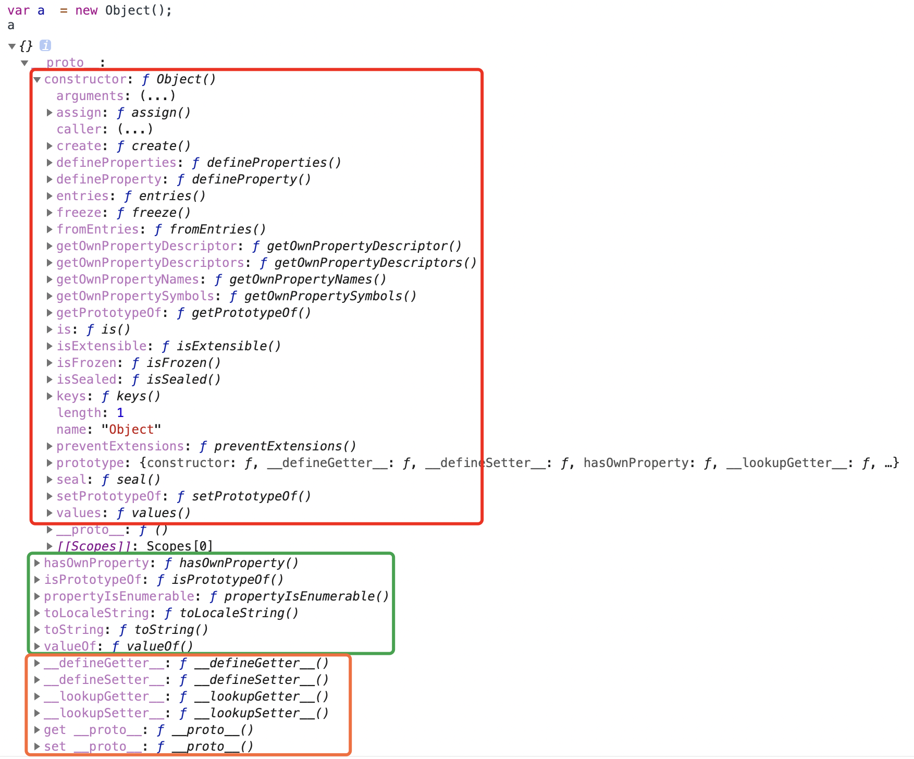

## Object对象的初始属性与方法


### 常用：
+ Object.assign()
+ Object.create(): 相当于new
+ Object.keys()
+ Object.values()
+ Object.entries()
+ Object.defineProperty()
+ Object.prototype.hasOwnProperty()

## 申明
```js
var person = {name:'cly'}; // 对象字面量申明
var person1 = new Object(); // new一个构造函数申明
person1.name = 'cly';
```

## 内存指向
对象申明指向的是内存（堆内存）中的一个地址：两个对象就算值相同，也不相等

## 其他见<面向对象>