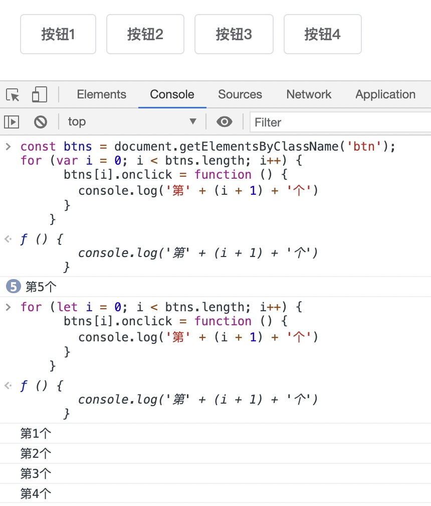

## 引言
js的执行分为两个阶段：
+ 创建阶段
  + 语法分析
  + <font color=red>作用域</font>确定: 创建阶段就已确定，不会改变
+ 执行阶段
  + 创建<font color=red>执行上下文</font>: 代码执行阶段确定，会随代码执行时机而改变
  + 执行代码
  + 垃圾回收

## 作用域
> 解释：变量/函数在代码中可被访问的范围
> 作用域是分层的，内层作用域可以访问外层作用域的变量，反之则不行


### 全局作用域
> 全局可访问
> 缺点：不必要的全局变量，容易造成命名冲突

包含：
+ window.xxx
+ 最外层变量/函数
+ 所有未定义直接赋值的变量


```js
var b = 2;
window.cccc = 3
function demo() {
    a = 1;
    window.ccc = 3
    function demo2() {
        window.cc = 3;
    }
}
console.log(a); // 1
console.log(b); // 2
console.log(cc); // cc is not defined
console.log(ccc); // ccc is not defined
console.log(cccc); // 4
```


### 函数作用域
> 在指定函数内可访问

包含：
+ 在函数内部申明的变量/函数

```js
function doSomething() {
    var blogName = "浪里行舟";
    function innerSay() {
        console.log(blogName); // '浪里行舟'
    }
    innerSay(); // '浪里行舟'
}
doSomething(); // '浪里行舟' (innerSay() => console.log(blogName) => doSomething里的blogName)
console.log(blogName); // blogName is not defined
innerSay(); // innerSay is not defined
```


### 块级作用域
> 在`{}`代码区块内可访问
>
> ES5没有块级作用域的概念，块级作用域是ES6的`let`和`const`新增的
>
> 函数作用域，也算块级作用域


```js
const btns = document.getElementsByClassName('btn');

// 使用var申明变量i，var的作用域在外层，未click之前已经遍历完，click时i为5
for (var i = 0; i < btns.length; i++) {
    console.log('外层i, 第' + (i + 1) + '个');
    btns[i].onclick = function () {
        console.log('第' + (i + 1) + '个');
    }
}
// 外层i, 第1个
// 外层i, 第2个
// 外层i, 第3个
// 外层i, 第4个
// 每次点击，都返回 第5个 （此时i为5）

// 使用let申明变量，let作用域在每次遍历中，onclick事件函数里的 i 在每次遍历的作用域中
for (let i = 0; i < btns.length; i++) {
    console.log('外层i, 第' + (i + 1) + '个');
    btns[i].onclick = function () {
        console.log('第' + (i + 1) + '个')
    }
}
// 外层i, 第1个
// 外层i, 第2个
// 外层i, 第3个
// 外层i, 第4个
// 每个按钮点击，依次返回 第1个 第2个 第3个 第4个
```



### 作用域链
> 变量的作用域，一层一层向上寻找，直到找到全局作用域。这种一层一层的关系，就是 作用域链


## 执行上下文与this指向
> 同一个作用域下，不同的调用会产生不同的执行上下文环境，继而产生不同的变量的值
>
> this的指向就是在执行时确定的

this指向，归纳几点：
+ 非构造函数的实例，且没有调用的对象时，指向window
+ 普通函数：返回`函数`时，指向`调用返回函数的对象`；返回`非函数`时，指向`调用函数的对象`
+ 构造函数：返回`对象`时，指向`返回的对象`；返回`非对象` 或 `无返回值` 或 `null`时，指向`实例`
+ apply、call、bind改变this指向
+ 箭头函数：this等于`创建`箭头函数时的外层作用域的this


### 普通函数
> 当函数返回`非函数`时，this指向 `调用函数的对象`
> 当函数返回`函数`时，this指向 `调用返回的函数的对象`

```js
var o = {
    a: 10,
    b: {
        a: 20,
        fn:function(){
            console.log(this.a); //20
        }
    }
}
o.b.fn(); // fn在o.b下执行，所以fn里的this指向o.b，所以this.a = o.b.a = 20
var m = o.b;
m.fn(); // fn在m下执行，所以fn里的this指向o.b，所以this.a = o.b.a = 20，同o.b.fn
var j = o.b.fn;
j(); // j = o.b.fn，j在window下执行，所以fn里的this指向window，所以this.a = window.a = undefined


var obj = {
    birth: 1990,
    getAge: function () {
        var b = this.birth; // 1990
        var fn = function () {
            console.log(this, this.birth);
        };
        return fn();
    }
};
obj.getAge(); // return fn(); 而fn是在window下调用，所以this指向window, this.birth为undefined

var obj1 = {
    b: 2,
    getB: function () {
        console.log(this)
    }
}
var obj = {
    birth: 1990,
    getAge: function () {
        return obj1.getB();
    }
};
obj.getAge(); // return obj1.getB(); getB是在obj1下，所以getB里的this指向obj1

var m = obj1.getB;
var obj = {
    birth: 1990,
    getAge: function () {
        return m();
    }
};
obj.getAge(); // return m(); m是在window下，所以getB里的this指向window
```


### 构造函数
> 当返回值为`对象`时，this指向返回的对象
> 当返回值`非对象` 或 `无返回值` 或 `null`时，this指向实例

```js
function Fn() {
    this.a = '1';
    this.cb = function() {
        this.a = '2';
    }
    return {}
}
var f1 = new Fn();
f1.a; // f1指向对象{}, 所以f1.a为undefined

function Fn() {
    this.a = '1';
    this.cb = function() {
        this.a = '2';
    }
    return function() {
        this.a = '3';
    }
}
var f1 = new Fn();
f1.a; // f1指向函数, f1.a出现语法报错

function Fn() {
    this.a = '1';
    return 111
}
var f1 = new Fn();
f1.a; // '1'

function Fn() {
    this.a = '1';
    this.cb = function() {
        this.a = '2'; // this指向实例
    }
}
var f1 = new Fn();
f1.a; // 1
f1.cb();
f1.a; // 2
```

### apply、call、bind
> 改变函数的调用对象


#### apply
+ Function.apply(obj, args)
+ 参数:
  + obj: 函数的调用对象，当obj为`null` 或 `undefined`时，不改变调用对象
  + args: 函数的n个参数组成的(类)数组
+ 返回: 函数的返回值
+ 其他常见使用方式
```js
// 1.代替多参数函数的args解构
// 比如Math.max
Math.max(2,4,5,6,7); // 7, 由多个参数组成，先要给数组解构
// 数组解构
var array = [2,4,5,6,7];
Math.max(...array);

// 使用apply
Math.max.apply(null, array);

// 2.实现两个数组合并
var arr1 = [1, 2, 3];
var arr2 = [4, 5, 6];
Array.prototype.push.apply(arr1, arr2);

// 3.拷贝构造函数的实例属性
function Super(){
    this.val = true;
    this.arr = ["a"];
}
Super.prototype.getVal = function () {
	console.log(this.val)
}
function Sub(){
       Super.call(this);
}
var sub = new Sub();
console.log(sub); // {val:true, arr:['a']}

// 4.类数组转数组, 可以使用foreach for..in等方法
const args = Array.prototype.slice.call(arguments);
```

#### call
+ Function.call(obj, ...args)
+ 参数:
  + obj: 函数的调用对象，当obj为`null` 或 `undefined`时，不改变调用对象
  + ...args: 函数的n个参数
+ 返回: 函数的返回值
+ 其他常见使用方式
  + 拷贝构造函数的实例属性(同apply)
  + 类数组转数组(同apply)


#### bind
+ Function.bind(obj, ...args)
+ 参数:
  + obj: 函数的调用对象, 当obj为 `null` 或 `undefined`时, this 就指向 window
  + ...args: 函数的n个参数
+ 返回: 一个新的函数，必须再执行新函数，才算改变函数的调用对象
+ 其他常见使用方式
  + 拷贝构造函数的实例属性(同apply)
  + 类数组转数组(同apply)

```js
function add (a, b) {
    return a + b;
}

function sub (a, b) {
    return a - b;
}

add.bind(sub, 5, 3); // 这时，并不会返回 8
add.bind(sub, 5, 3)(); // 调用后，返回 8
```


### 箭头函数
> this指向**创建**这个箭头函数时的外层作用域的this

```js
var obj = {
    birth: 1,
    getAge: function () {
        console.log('getAge',this);
        var fn = () => {
            console.log('fn',this); // this指向getAge()的this，而getAge()的this，看调用的对象
        };
        return fn();
    }
};
obj.getAge(); // return fn(); fn是个箭头函数，箭头函数的this永久指向外层调用者，这里是obj

var obj = {
    birth: 1990,
    objj: {
        birth: 1999,
        getb: function () {
            var fn = () => {
                console.log(this); // 指向obj.objj.getb里的this
            }
            return fn()
        }
    },
    objjj: {
        getc: () => {
            console.log(this); // 指向obj.objjj的this
        }
    },
    getAge: function () {
        var fn =  () => {
            console.log(this); // 指向obj.getAge里的this
        };
        return this.objj.getb(); // 与return无关
    }
};

var m = obj.objj;
m.getb(); // fn的this指向obj.objj

var n = obj.objjj;
n.getc(); // obj.objjj就是n，n的this指向window，所以这边this为window

obj.getAge(); // fn里的this指向obj
```


### 一个例子对比
```js
function foo() {
    console.log("id1:", this.id);
    console.log("this1:", this);
    setTimeout(function() {
        console.log("id2:", this.id);
        console.log("this2:", this);
    }, 0);
}

var id = 21;

foo();
// id1: 21,  // this指向window
// this1: window,
// id2: 21,  // settimeout里的cb函数默认在全局作用域环境执行
// this2: window,

// 使用call
foo.call({id: 42});
// id1: 42,  // this指向{id: 42}
// this1: {id: 42},
// id2: 21,  // settimeout里的cb函数默认在全局作用域环境执行
// this2: window,

// 使用箭头函数
function foo() {
    console.log("id1:", this.id);
    console.log("this1:", this);
    setTimeout(() => {
        console.log("id2:", this.id);
        console.log("this2:", this);
    }, 0);
}
foo.call({id: 42});
// id1: 42,  // this指向window
// this1: {id: 42},
// id2: 42,  // 箭头函数的this = 创建时外层作用域的this
// this2: {id: 42},
```