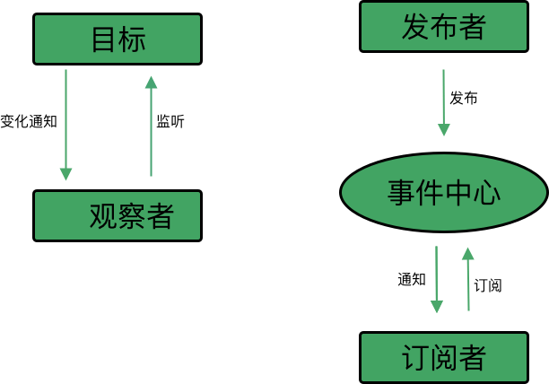

## 区别



###  观察者模式
+ **目标<=>观察者**, 目标发生变化 -> 目标主动通知观察者 -> 观察者观察目标（监听目标）
+ 目标发生变化，`所有观察者`都会接收到通知，并自动更新


### 发布/订阅模式
> **发布者->事件中心<=>订阅者**，订阅者需要向事件中心订阅指定的事件 -> 发布者向事件中心发布指定事件内容 -> 事件中心通知订阅者 -> 订阅者收到消息（可能是多个订阅者），到此完成了一次订阅发布的流程
> 发布者发生变化，通知事件中心，事件中心`过滤后，按需`传给对应订阅者


## 实现

### 观察者模式
```js
// 目标发生变化，主动通知观察者
function Subject() {
    this.observers = []; // 观察者
    this.add = (observer) => { // 目标与观察者建立联系
        this.observers.push(observer);
    },
    this.notify = (...args) => { // 目标变化，通知观察者(执行观察者的update方法)
        this.observers.forEach(observer => {
            observer.update(...args)
        })
    }
}
// 观察者接收通知
function Observer() {
    this.update = (...args) => {
        console.log(...args)
    }
}

const obs1 = new Observer();
const obs2 = new Observer();
const sub = new Subject();
sub.add(obs1);
sub.add(obs2);

sub.notify('目标发生变化');
```


### 发布/订阅模式
```js
// 调度中心
function Emitter() {
    this.subscribers = {}; // 存储发布与订阅的关系

    this.on = (topic, callback) => { // 订阅操作: topic: 事件的唯一key, callback: 传给订阅者的信息
        let callbacks = this.subscribers[topic]; // 一个事件可能对应多条信息
        if(!callbacks) {
            this.subscribers[topic] = [callback];
        } else {
            callbacks.push(callback);
        }
    }

    this.emit = (topic, ...args) => { // 发布操作
        let callbacks = this.subscribers[topic] || [];
        callbacks.forEach(callback => {
            callback(...args);
        })
    }
}

const emit = new Emitter();
emit.on('change-test', (...args) => {
    console.log(args);
})
emit.on('change-test2', (...args) => {
    console.log(args);
})
emit.emit('change-test', '测试 change');
emit.emit('change-test1', '测试1 change');
```