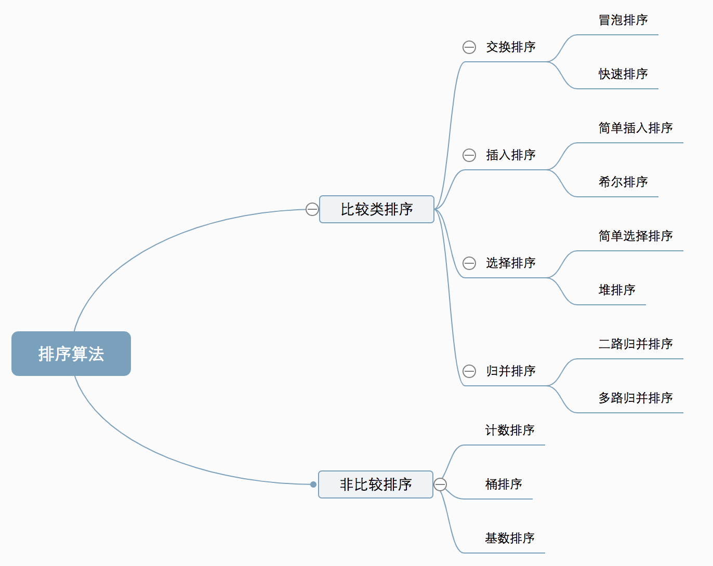

## 排序分类



## 排序对比


```js
const arr = [5,9,7,6,1,8,13,4];
const len = arr.length;
```

## 交换排序 - 冒泡排序

### 单向冒泡
> 从左到右，比较相邻的元素，将更大的值放到后面
>
> 每次比较不同时都要交换位置
>
> 比较`len-1`*`len-1-i`次


```js
for(let i = 0; i < len - 1; i++) {
    if (arr[i] > arr[i+1]) {
        let temp = arr[i+1];
        arr[i+1] = arr[i];
        arr[i] = temp;
    }
}
// 以上只是完成了一个数与其他数的对比

// 所有数都要经过与其他数的对比，必须要有两层循环
for(let i = 0; i < len - 1; i++) { // 所有数(除了最后一个数，因为最后一个数肯定是最大值，不需要再比) => 执行len-1次
    const tempArr = [arr[0]];
    for(let j = 0; j < len - 1 - i; j++) {
        tempArr.push(arr[j+1]);
    }
    console.log(`第${i+1}轮比较的数有:`, tempArr);
    for(let j = 0; j < len - 1 - i; j++) { // 指定数字对应的其他数 => 执行len-1-i次
        let change = false;
        let changeArr = [arr[j], arr[j+1]];
        if (arr[j] > arr[j+1]) {
            let temp = arr[j+1];
            arr[j+1] = arr[j];
            arr[j] = temp;
            change = true;
        }
        console.log(`${changeArr} => ${change?'交换':'不变'}: `,arr);
    }
}
// 第1轮比较的数有: (8) [5, 9, 7, 6, 1, 8, 13, 4]
//  5,9 => 不变:  (8) [5, 9, 7, 6, 1, 8, 13, 4]
//  9,7 => 交换:  (8) [5, 7, 9, 6, 1, 8, 13, 4]
//  9,6 => 交换:  (8) [5, 7, 6, 9, 1, 8, 13, 4]
//  9,1 => 交换:  (8) [5, 7, 6, 1, 9, 8, 13, 4]
//  9,8 => 交换:  (8) [5, 7, 6, 1, 8, 9, 13, 4]
//  9,13 => 不变:  (8) [5, 7, 6, 1, 8, 9, 13, 4]
//  13,4 => 交换:  (8) [5, 7, 6, 1, 8, 9, 4, 13]
// 第2轮比较的数有: (7) [5, 7, 6, 1, 8, 9, 4]
//  5,7 => 不变:  (8) [5, 7, 6, 1, 8, 9, 4, 13]
//  7,6 => 交换:  (8) [5, 6, 7, 1, 8, 9, 4, 13]
//  7,1 => 交换:  (8) [5, 6, 1, 7, 8, 9, 4, 13]
//  7,8 => 不变:  (8) [5, 6, 1, 7, 8, 9, 4, 13]
//  8,9 => 不变:  (8) [5, 6, 1, 7, 8, 9, 4, 13]
//  9,4 => 交换:  (8) [5, 6, 1, 7, 8, 4, 9, 13]
// 第3轮比较的数有: (6) [5, 6, 1, 7, 8, 4]
//  5,6 => 不变:  (8) [5, 6, 1, 7, 8, 4, 9, 13]
//  6,1 => 交换:  (8) [5, 1, 6, 7, 8, 4, 9, 13]
//  6,7 => 不变:  (8) [5, 1, 6, 7, 8, 4, 9, 13]
//  7,8 => 不变:  (8) [5, 1, 6, 7, 8, 4, 9, 13]
//  8,4 => 交换:  (8) [5, 1, 6, 7, 4, 8, 9, 13]
// 第4轮比较的数有: (5) [5, 1, 6, 7, 4]
//  5,1 => 交换:  (8) [1, 5, 6, 7, 4, 8, 9, 13]
//  5,6 => 不变:  (8) [1, 5, 6, 7, 4, 8, 9, 13]
//  6,7 => 不变:  (8) [1, 5, 6, 7, 4, 8, 9, 13]
//  7,4 => 交换:  (8) [1, 5, 6, 4, 7, 8, 9, 13]
// 第5轮比较的数有: (4) [1, 5, 6, 4]
//  1,5 => 不变:  (8) [1, 5, 6, 4, 7, 8, 9, 13]
//  5,6 => 不变:  (8) [1, 5, 6, 4, 7, 8, 9, 13]
//  6,4 => 交换:  (8) [1, 5, 4, 6, 7, 8, 9, 13]
// 第6轮比较的数有: (3) [1, 5, 4]
//  1,5 => 不变:  (8) [1, 5, 4, 6, 7, 8, 9, 13]
//  5,4 => 交换:  (8) [1, 4, 5, 6, 7, 8, 9, 13]
// 第7轮比较的数有: (2) [1, 4]
//  1,4 => 不变:  (8) [1, 4, 5, 6, 7, 8, 9, 13]
```

#### 实现
```js
const arr = [5,9,7,6,1,8,13,4];
function bubbleSort1(arr) {
    const len = arr.length;
    for(let i = 0; i < len - 1; i++) {
        for(let j = 0; j < len - 1 - i; j++) {
            if (arr[j] > arr[j+1]) {
                let temp = arr[j+1];
                arr[j+1] = arr[j];
                arr[j] = temp;
            }
        }
    }
    return arr;
}
bubbleSort1(arr); // [1, 4, 5, 6, 7, 8, 9, 13] => 时间复杂度为: O(n^2)
```

### 双向冒泡
> 从左往右，比较相邻的元素，将更大的值放到后面
>
> 再从右往左，比较相邻的元素，将更小的值放到前面
>
> 每次比较不同时都要交换位置


```js
let start = 0, end = len - 1;
let count = 0;
while(start < end) {
    console.log('========> start, end',start, end);
    count++;

    const tempArr1 = [arr[start]];
    for(let i = start; i < end; i++) {
        tempArr1.push(arr[i+1]);
    }
    console.log(`第${count}轮, 左 => 右，比较的数有:`, tempArr1);

    for(let i = start; i < end; i++) {
        let change = false;
        let changeArr = [arr[i], arr[i+1]];
        if(arr[i] > arr[i + 1]) {
            let temp = arr[i + 1];
            arr[i + 1] = arr[i];
            arr[i] = temp;
            change = true;
        }
        console.log(`${changeArr} => ${change?'交换':'不变'}: `,arr);
    }
	end--;
    console.log('========左 => 右后 start, end',start, end);

    const tempArr2 = [arr[end]];
    for(let i = end; i > start; i--) {
        tempArr2.unshift(arr[i-1]);
    }
    console.log(`第${count}轮, 左 <= 右，比较的数有:`, tempArr2);

    for(let i = end; i > start; i--) {
        let change = false;
        let changeArr = [arr[i-1], arr[i]];
        if(arr[i - 1] > arr[i]) {
            let temp = arr[i - 1];
            arr[i - 1] = arr[i];
            arr[i] = temp;
            change = true;
        }
        console.log(`${changeArr} => ${change?'交换':'不变'}: `,arr);
    }
    start++;
    console.log('========左 <= 右后 start, end',start, end);
}
// 第1轮, 左 => 右，比较的数有: (8) [5, 9, 7, 6, 1, 8, 13, 4]
//  5,9 => 不变:  (8) [5, 9, 7, 6, 1, 8, 13, 4]
//  9,7 => 交换:  (8) [5, 7, 9, 6, 1, 8, 13, 4]
//  9,6 => 交换:  (8) [5, 7, 6, 9, 1, 8, 13, 4]
//  9,1 => 交换:  (8) [5, 7, 6, 1, 9, 8, 13, 4]
//  9,8 => 交换:  (8) [5, 7, 6, 1, 8, 9, 13, 4]
//  9,13 => 不变:  (8) [5, 7, 6, 1, 8, 9, 13, 4]
//  13,4 => 交换:  (8) [5, 7, 6, 1, 8, 9, 4, 13]
//  ========左 => 右后 start, end 0 6
//  第1轮, 左 <= 右，比较的数有: (7) [5, 7, 6, 1, 8, 9, 4]
//  9,4 => 交换:  (8) [5, 7, 6, 1, 8, 4, 9, 13]
//  8,4 => 交换:  (8) [5, 7, 6, 1, 4, 8, 9, 13]
//  1,4 => 不变:  (8) [5, 7, 6, 1, 4, 8, 9, 13]
//  6,1 => 交换:  (8) [5, 7, 1, 6, 4, 8, 9, 13]
//  7,1 => 交换:  (8) [5, 1, 7, 6, 4, 8, 9, 13]
//  5,1 => 交换:  (8) [1, 5, 7, 6, 4, 8, 9, 13]
//  ========左 <= 右后 start, end 1 6
// ========> start, end 1 6
// 第2轮, 左 => 右，比较的数有: (6) [5, 7, 6, 4, 8, 9]
//  5,7 => 不变:  (8) [1, 5, 7, 6, 4, 8, 9, 13]
//  7,6 => 交换:  (8) [1, 5, 6, 7, 4, 8, 9, 13]
//  7,4 => 交换:  (8) [1, 5, 6, 4, 7, 8, 9, 13]
//  7,8 => 不变:  (8) [1, 5, 6, 4, 7, 8, 9, 13]
//  8,9 => 不变:  (8) [1, 5, 6, 4, 7, 8, 9, 13]
//  ========左 => 右后 start, end 1 5
//  第2轮, 左 <= 右，比较的数有: (5) [5, 6, 4, 7, 8]
//  7,8 => 不变:  (8) [1, 5, 6, 4, 7, 8, 9, 13]
//  4,7 => 不变:  (8) [1, 5, 6, 4, 7, 8, 9, 13]
//  6,4 => 交换:  (8) [1, 5, 4, 6, 7, 8, 9, 13]
//  5,4 => 交换:  (8) [1, 4, 5, 6, 7, 8, 9, 13]
//  ========左 <= 右后 start, end 2 5
// ========> start, end 2 5
// 第3轮, 左 => 右，比较的数有: (4) [5, 6, 7, 8]
//  5,6 => 不变:  (8) [1, 4, 5, 6, 7, 8, 9, 13]
//  6,7 => 不变:  (8) [1, 4, 5, 6, 7, 8, 9, 13]
//  7,8 => 不变:  (8) [1, 4, 5, 6, 7, 8, 9, 13]
//  ========左 => 右后 start, end 2 4
//  第3轮, 左 <= 右，比较的数有: (3) [5, 6, 7]
//  6,7 => 不变:  (8) [1, 4, 5, 6, 7, 8, 9, 13]
//  5,6 => 不变:  (8) [1, 4, 5, 6, 7, 8, 9, 13]
//  ========左 <= 右后 start, end 3 4
// ========> start, end 3 4
// 第4轮, 左 => 右，比较的数有: (2) [6, 7]
//  6,7 => 不变:  (8) [1, 4, 5, 6, 7, 8, 9, 13]
//  ========左 => 右后 start, end 3 3
//  第4轮, 左 <= 右，比较的数有: [6]
//  ========左 <= 右后 start, end 4 3
```

#### 实现
```js
const arr = [5,9,7,6,1,8,13,4];
function bubbleSort2(arr) {
    let len = arr.length;
    let start = 0, end = len - 1;
    while(start < end) {
        for(let i = start; i < end; i++) {
            if(arr[i] > arr[i + 1]) {
                let temp = arr[i + 1];
                arr[i + 1] = arr[i];
                arr[i] = temp;
            }
        }
        end--;

        for(let i = end; i > start; i--) {
            if(arr[i - 1] > arr[i]) {
                let temp = arr[i - 1];
                arr[i - 1] = arr[i];
                arr[i] = temp;
            }
        }
        start++;
    }
    return arr;
}
bubbleSort2(arr); // [1, 4, 5, 6, 7, 8, 9, 13] => 时间复杂度为: O(n)
```


### 性能比较
```js
console.time('单向冒泡');
bubbleSort1(arr);
console.timeEnd('单向冒泡');
// 单向冒泡: 0.09814453125 ms

console.time('双向冒泡');
bubbleSort2(arr);
console.timeEnd('双向冒泡');
// 双向冒泡: 0.069091796875 ms
```


## 交换排序 - 快速排序
> 选基数(可以选择中间索引的值)
>
> 划分区：比基数小的在左，大的在右
>
> 递归：对初次划分出来的两个无序区间，递归调用第 1步和第 2步的算法，直到所有无序区间都只剩下一个元素为止。


### 实现
```js
const arr = [5,9,7,6,1,8,13,4];
function quickSort(arr) {
    let len = arr.length;
    if (!len) return arr;

    const pivotIndex = Math.floor(len / 2);
    const pivot = arr.splice(pivotIndex, 1)[0];
    len = arr.length;
    const left = [];
    const right = [];
    for(let i = 0; i < len; i++) {
        const item = arr[i];
        if (item < pivot) {
            left.push(item);
        } else {
            right.push(item);
        }
    }
    return quickSort(left).concat([pivot], quickSort(right));
}
quickSort(arr); // [1, 4, 5, 6, 7, 8, 9, 13]，时间复杂度 O(n*log2^n)
```


## 选择排序 - 选择排序
> 选第1个数，作为最小值
>
> 比较基数与其他数，比较完毕后，将新的最小值 与 基数 交换位置
>
> 依次第2个数，重复第1步和第2步


### 实现
```js
const arr = [5,9,7,6,1,8,13,4];
function selectionSort(arr) {
    let len = arr.length;
    let minIndex, temp;
    for (let i = 0; i < len - 1; i++) {
        minIndex = i;
        for (let j = i + 1; j < len; j++) {
            if (arr[j] < arr[minIndex]) {     //寻找最小的数
                minIndex = j;                 //将最小数的索引保存
            }
        }
        temp = arr[i];
        arr[i] = arr[minIndex];
        arr[minIndex] = temp;
    }
    return arr;
}
selectionSort(arr); // [1, 4, 5, 6, 7, 8, 9, 13]，时间复杂度 O(n^2)
```

## 插入排序 - 插入排序(抓扑克牌)
> 类似于抓扑克牌：刚抓到的牌, 和手上已经抓到排好的牌从后向前一张张比过去，再插入到相应位置。


### 实现
```js
const arr = [5,9,7,6,1,8,13,4];
function insertionSort(arr) {
    let len = arr.length;
    let preIndex, current;
    for (let i = 1; i < len; i++) { // 第1张牌不需要排，从第2张牌开始插
        preIndex = i - 1;
        current = arr[i];
        while(preIndex >= 0 && arr[preIndex] > current) { // 比较拿到的牌与手上的牌
            arr[preIndex+1] = arr[preIndex]; // 最后一张牌 > 手上的牌，往后移
            preIndex--; // 继续比较前一张
        }
        arr[preIndex+1] = current; // 手上的牌都是已经排序过的,比较结束后,插入拿到的牌
    }
    return arr;
}
insertionSort(arr); // [1, 4, 5, 6, 7, 8, 9, 13]，时间复杂度 O(n^2)
```
