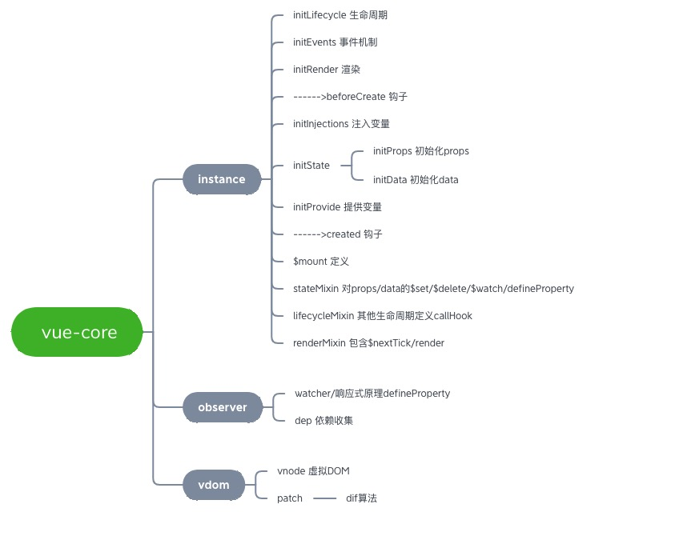

## Vue不依赖平台
> Vue使用了抽象节点VNode，它是对真实DOM的一层抽象，不依赖某个平台，
>
> 它可以是浏览器平台，也可以是weex，甚至是node平台也可以对这样一棵抽象DOM树进行创建删除修改等操作，这也为前后端同构提供了可能。


##  一步步看源码




### 1.Vue构造函数
```js
// 入口文件core/instance/index.js
import { initMixin } from './init'
import { stateMixin } from './state'
import { renderMixin } from './render'
import { eventsMixin } from './events'
import { lifecycleMixin } from './lifecycle'
import { warn } from '../util/index'

function Vue (options) {
  if (process.env.NODE_ENV !== 'production' &&
    !(this instanceof Vue)
  ) {
    warn('Vue is a constructor and should be called with the `new` keyword')
  }
  this._init(options); // 初始化挂载
}

// mixin进来各种功能
initMixin(Vue)
stateMixin(Vue)
eventsMixin(Vue)
lifecycleMixin(Vue)
renderMixin(Vue)

// 返回Vue构造函数
export default Vue
```

### 2.初始化及挂载


源码
```js
// src/core/instance/init.js
Vue.prototype._init = function (options?: Object) {
    const vm: Component = this

    // ...

    /** 初始化 */
    vm._self = vm
    initLifecycle(vm)
    initEvents(vm)
    initRender(vm)
    callHook(vm, 'beforeCreate')
    initInjections(vm)
    initState(vm) // 初始化props、data、methods，并实现响应式
    initProvide(vm)
    callHook(vm, 'created')

    // ...

    /** 挂载 */
    if (vm.$options.el) {
        vm.$mount(vm.$options.el)
    }
}
```
### 3.响应式、依赖收集、computed、watch
初始化时，实现响应式、依赖收集、computed、watch。
引申:
+ [02.响应式、数据绑定、依赖收集](/blog/pages/2a7622/)
+ [03.computed的实现原理](/blog/pages/ffbe35/)
+ [03.watch的实现原理](/blog/pages/15d7ff/)

### 4.从template到vnode，更新视图
1. $mount处理:
   1. 不存在`render`但存在`template`模板时，进入`编译`步骤
   2. 存在`render`时，直接进入组件挂载`mountComponent`
2. `render function`生成`vnode`后，进入组件挂载`mountComponent`
3. 当 `render function` 被渲染的时候，因为会读取所需对象的值，所以会触发 `getter` 函数进行「`依赖收集`」
4. `updateComponent`方法来达到更新视图


引申:
+ [05.从template到vnode](/blog/pages/a13a4a/)
+ [06.从vnode到更新视图](/blog/pages/e6292e/)


