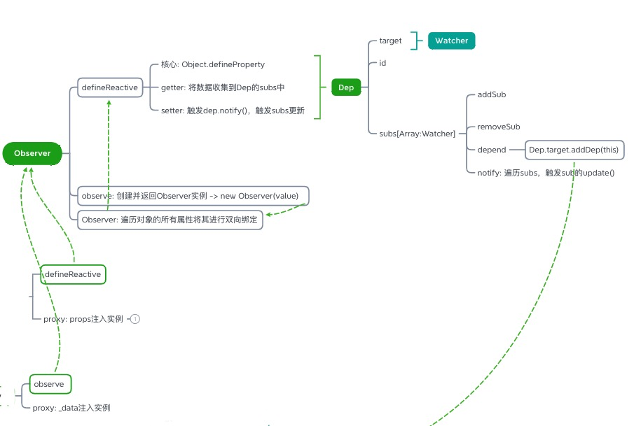
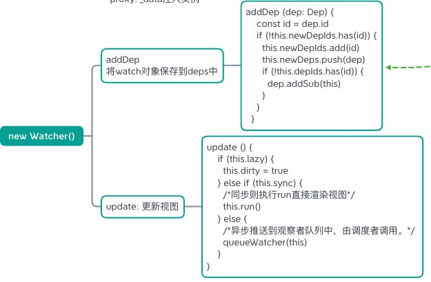

## 如何理解Vue的响应式、数据绑定、依赖收集
+ Vue的响应式是指修改数据时，能实时更新视图
+ Vue的响应式实现，依赖于`Object.defineProperty`，`Vue`通过设定对象属性的 `setter`/`getter` 方法来监听数据的变化，通过`getter`进行`依赖收集`，而每个`setter`方法就是一个`观察者`，在数据变更的时候通知订阅者更新视图
+ 依赖收集: 将


## 响应式过程解析


### 一、初始化
+ Vue在初始化包含 `props`, `data`, `computed`, `watch`, `methods`


```js
// src/core/instance/state.js
export function initState (vm: Component) {
    vm._watchers = []
    const opts = vm.$options
    if (opts.props) initProps(vm, opts.props) // 初始化props
    if (opts.methods) initMethods(vm, opts.methods) // 初始化methods
    if (opts.data) {
        initData(vm) // 初始化data
    } else {
        observe(vm._data = {}, true /* asRootData */)
    }
    if (opts.computed) initComputed(vm, opts.computed) // 初始化computed
    if (opts.watch && opts.watch !== nativeWatch) {
        initWatch(vm, opts.watch) // 初始化watch
    }
}
```

### 二、initProps, initData


+ `props`, `data`使用`proxy`注入到实例中
+ `props`遍历所有`key`，使用`defineReactive`实现响应式
+ `data`使用`observe`返回一个`Observer`实例，`Observer`遍历所有的`key`实现响应式

> 注意点：data 必须是一个函数:
>
> 保证每一个实例的data属性都是独立的，不会相互影响了, 如果不是函数，而是一个属性的话，实例属性所有的实例都公用，会互相影响

源码:
```js
// 初始化 props
function initProps (vm: Component, propsOptions: Object) {
    // ...

    for (const key in propsOptions) {
        keys.push(key)
        const value = validateProp(key, propsOptions, propsData, vm)
        if (process.env.NODE_ENV !== 'production') {
            // ...

            defineReactive(props, key, value, () => {  // !!!!! src/core/observer/index.js
                // ...
            })
        } else {
            defineReactive(props, key, value) // !!!!! src/core/observer/index.js
        }
        if (!(key in vm)) { // 静态props已经存到组件的prototype中，使用Vue.extend()创建组件中，再将动态props存到组件的prototype中
            proxy(vm, `_props`, key) // !!!!! Object.defineProperty
        }
    }
    // ...
}

// 初始化 data
function initData (vm: Component) {
    let data = vm.$options.data
    data = vm._data = typeof data === 'function'
        ? getData(data, vm)
        : data || {}
    if (!isPlainObject(data)) {
        // data 必须是一个函数:
        // => 保证每一个实例的data属性都是独立的，不会相互影响了
        // ===> 如果不是函数，而是一个属性的话，实例属性所有的实例都公用，会互相影响
        data = {}
        process.env.NODE_ENV !== 'production' && warn(
        'data functions should return an object:\n' +
        'https://vuejs.org/v2/guide/components.html#data-Must-Be-a-Function',
        vm
        )
    }
    const keys = Object.keys(data)
    let i = keys.length
    while (i--) {
        const key = keys[i]
        // ...
        proxy(vm, `_data`, key) // !!!!! Object.defineProperty
    }
    // observe data
    observe(data, true /* asRootData */) // !!!!! src/core/observer/index.js
}
```

### 三、proxy将`_props`和`_data`注入到实例
+ `Object.defineProperty`添加`getter`/`setter`方法，设置并监听数据变化


```js
export function proxy (target: Object, sourceKey: string, key: string) {
    sharedPropertyDefinition.get = function proxyGetter () {
        return this[sourceKey][key]
    }
    sharedPropertyDefinition.set = function proxySetter (val) {
        this[sourceKey][key] = val
    }
    Object.defineProperty(target, key, sharedPropertyDefinition)
}
```

### 四、Observer对象与Dep、Watcher实现响应式、依赖收集、数据绑定


#### 1.observe方法、Observer对象处理不同数据类型


```js
// observe方法返回一个Observer实例
export function observe (value: any, asRootData: ?boolean): Observer | void {
    // ...
    let ob = new Observer(value)
    // ...
    return ob
}
// Observer实例调用defineReactive，定义数据的getter, setter
export class Observer {
    value: any;
    dep: Dep;
    vmCount: number;
    constructor (value: any) {
        this.value = value
        this.dep = new Dep()
        this.vmCount = 0
        def(value, '__ob__', this)
        if (Array.isArray(value)) { // 数组 => 遍历 => observe => Observer实例... => 最后转成对象进入 defineReactive 处理
            this.observeArray(value)
        } else { // 对象 => defineReactive
            this.walk(value)
        }
    }
    walk (obj: Object) {
        const keys = Object.keys(obj)
        for (let i = 0; i < keys.length; i++) {
            defineReactive(obj, keys[i])
        }
    }
    observeArray (items: Array<any>) {
        for (let i = 0, l = items.length; i < l; i++) {
            observe(items[i])
        }
    }
}
```

#### 2.defineReactive 实现依赖收集 与 响应式

```js
function defineReactive (obj, key, val, cb) {
    const dep = new Dep()

    Object.defineProperty(obj, key, {
        enumerable: true,
        configurable: true,
        get: ()=>{
            /*....依赖收集等....*/
            if (Dep.target) {
                dep.depend() // 将watcher对象保存到deps中
                if (childOb) {
                    childOb.dep.depend()
                    if (Array.isArray(value)) {
                        dependArray(value)
                    }
                }
            }

            return val
        },
        set:newVal=> {
            val = newVal;
            cb();/*订阅者收到消息的回调*/

            dep.notify(); // 通知更新视图
        }
    })
}
```

#### 3.Dep 实现依赖收集
```js
export default class Dep {
    static target: ?Watcher; // 静态属性，target是个Watcher实例
    id: number;
    subs: Array<Watcher>;  // subs存储Watcher队列

    constructor () {
        this.id = uid++
        this.subs = []
    }

    addSub (sub: Watcher) {
        this.subs.push(sub)
    }

    removeSub (sub: Watcher) {
        remove(this.subs, sub)
    }

    depend () {
        if (Dep.target) {
            Dep.target.addDep(this) // watcher方法
        }
    }

    notify () {
        const subs = this.subs.slice()
        if (process.env.NODE_ENV !== 'production' && !config.async) {
            subs.sort((a, b) => a.id - b.id)
        }
        for (let i = 0, l = subs.length; i < l; i++) {
            subs[i].update()
        }
    }
}
```

#### 4.Watcher 记录依赖，更新视图

1. `Dep.target`静态属性指向`Watcher实例`
2. `Dep`的实例方法`depend`，调用`Watcher`的`addDep`方法，将`Wathcer`实例存储到`Dep.subs`中，并将`Dep.id`存储到`Wathcer.depIds`
3. `update`方法更新视图

```js
// Dep.depend
export default class Dep {
    static target: ?Watcher; // 静态属性，target是个Watcher实例
    id: number;
    subs: Array<Watcher>;  // subs存储Watcher队列
    depend () {
        if (Dep.target) {
            Dep.target.addDep(this) // watcher方法
        }
    }
}
// Watcher
export default class Watcher {
  vm: Component;
  expression: string;
  cb: Function;
  id: number;
  deep: boolean;
  user: boolean;
  lazy: boolean;
  sync: boolean;
  dirty: boolean;
  active: boolean;
  deps: Array<Dep>;
  newDeps: Array<Dep>;
  depIds: SimpleSet;
  newDepIds: SimpleSet;
  before: ?Function;
  getter: Function;
  value: any;

  constructor (
    vm: Component,
    expOrFn: string | Function,
    cb: Function,
    options?: ?Object,
    isRenderWatcher?: boolean
  ) {
    this.vm = vm
    if (isRenderWatcher) {
      vm._watcher = this
    }
    vm._watchers.push(this)
    this.cb = cb
    this.id = ++uid // uid for batching
    this.active = true
    this.deps = []
    this.newDeps = []
    this.depIds = new Set()
    this.newDepIds = new Set()

    addDep (dep: Dep) {
        const id = dep.id
        if (!this.newDepIds.has(id)) {
            this.newDepIds.add(id)
            this.newDeps.push(dep)
            if (!this.depIds.has(id)) {
                dep.addSub(this)
            }
        }
    }
    cleanupDeps () {
        let i = this.deps.length
        while (i--) {
            const dep = this.deps[i]
            if (!this.newDepIds.has(dep.id)) {
                dep.removeSub(this)
            }
        }
        let tmp = this.depIds
        this.depIds = this.newDepIds
        this.newDepIds = tmp
        this.newDepIds.clear()
        tmp = this.deps
        this.deps = this.newDeps
        this.newDeps = tmp
        this.newDeps.length = 0
    }
    update () {
        if (this.lazy) {
            this.dirty = true
        } else if (this.sync) {
            this.run()
        } else {
            queueWatcher(this)  // => nextTick...
        }
    }
    run () {
        if (this.active) {
            const value = this.get()
            if (
                value !== this.value ||
                isObject(value) ||
                this.deep
            ) {
                const oldValue = this.value
                this.value = value
                if (this.user) {
                    try {
                        this.cb.call(this.vm, value, oldValue) // !! 更新视图
                    } catch (e) {
                        handleError(e, this.vm, `callback for watcher "${this.expression}"`)
                    }
                } else {
                    this.cb.call(this.vm, value, oldValue) // !! 更新视图
                }
            }
        }
    }
}
```